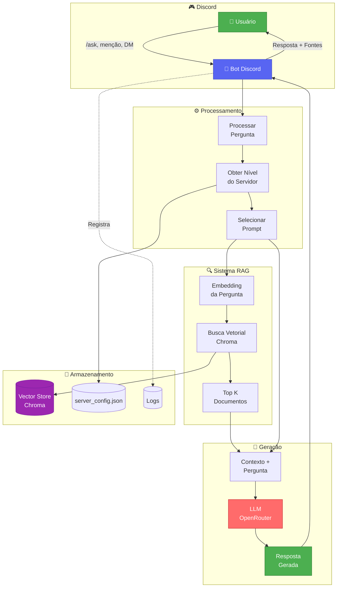
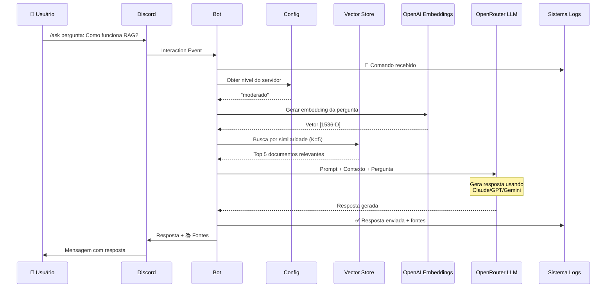

# Arquitetura

## Visão Geral do Sistema

O projeto implementa um pipeline RAG (Retrieval-Augmented Generation) completo:

```
PDFs → Indexação → Vector Store → Recuperação → LLM → Resposta
```

## Componentes Principais

### 1. Sistema de Indexação (`load.py`)

Responsável por processar documentos PDF e criar o banco vetorial.

**Workflow**:
1. Carrega PDFs da pasta `data/`
2. Divide em chunks (1000 chars, overlap 200)
3. Gera embeddings via OpenAI API
4. Persiste no Chroma vector store

**Características**:
- Suporta múltiplos PDFs simultaneamente
- Progress bar durante indexação
- Validação de diretórios e arquivos

### 2. Bot Discord (`bot.py`)

Aplicação principal que integra Discord e RAG.

**Responsabilidades**:
- Carrega vector store Chroma
- Processa interações Discord (slash commands, menções, DMs)
- Recupera contexto relevante via busca vetorial
- Gera respostas via LLM (OpenRouter)
- Gerencia configurações por servidor
- Sistema completo de logging

### 3. Sistema de Configuração

Gerencia personalização por servidor.

**Arquivo**: `server_config.json`  
**Estrutura**:
```json
{
  "123456789": {
    "nivel": "moderado"
  },
  "987654321": {
    "nivel": "liberal"
  }
}
```

**Níveis disponíveis**:
- **conservador**: Formal, profissional, neutro
- **moderado**: Equilibrado, empático, informativo (padrão)
- **liberal**: Casual, descontraído, autêntico

### 4. Sistema de Logs

Sistema robusto de logging com rotação automática.

**Características**:
- RotatingFileHandler (5MB max, 5 backups)
- Formato estruturado: `timestamp | nível | mensagem`
- Stack traces completos em erros
- UTF-8 encoding

**Localização**: `logs/bot.log`

## Fluxo de Dados

### Pipeline RAG Completo



### Processamento de Pergunta - Sequência Temporal



**Etapas Detalhadas:**

1. **Recebimento**: Discord (comando, menção ou DM)
2. **Validação**: Verifica se RAG está carregado
3. **Configuração**: Obtém nível de filtro do servidor
4. **Recuperação**: Busca K documentos mais relevantes (padrão: 5)
5. **Geração**: LLM cria resposta usando contexto
6. **Resposta**: Envia ao usuário com fontes

### Sistema de Prompts

O bot utiliza prompts diferentes baseados no nível configurado:

```python
PROMPTS_POR_NIVEL = {
    "conservador": "Prompt formal e profissional...",
    "moderado": "Prompt equilibrado e empático...",
    "liberal": "Prompt casual e autêntico..."
}
```

Cada prompt é injetado dinamicamente no chain do LangChain.

## Tecnologias e Bibliotecas

### Core

- **Python 3.11** - Linguagem base
- **discord.py** - Framework Discord Bot
- **LangChain 1.0** - Orquestração RAG

### RAG Pipeline

- **Chroma** - Banco de dados vetorial
- **OpenAI Embeddings API** - text-embedding-3-small
- **OpenRouter** - Gateway para LLMs (Claude, GPT, etc.)

### Processamento de Documentos

- **pypdf** - Leitura de PDFs
- **RecursiveCharacterTextSplitter** - Divisão de texto

### Infraestrutura

- **python-dotenv** - Gerenciamento de variáveis
- **logging** - Sistema de logs
- **json** - Persistência de configurações

## Estrutura de Diretórios

```
.
├── data/                    # PDFs para indexação
├── vectorstore/             # Chroma DB (gerado)
├── logs/                    # Logs rotativos
│   ├── bot.log
│   ├── bot.log.1
│   └── bot.log.2
├── docs/                    # Documentação MkDocs
├── load.py                  # Script de indexação
├── bot.py                   # Bot Discord
├── requirements.txt         # Dependências
├── server_config.json       # Configs por servidor
├── .env                     # Variáveis de ambiente
└── mkdocs.yml              # Configuração MkDocs
```

## Decisões de Design

### Por que Chroma?

- **Leveza**: Menor uso de disco vs FAISS
- **Facilidade**: API simples e direta
- **Persistência**: Salva automaticamente em disco
- **Integração**: Suporte nativo LangChain

### Por que OpenAI Embeddings?

- **Qualidade**: Excelente para português
- **Custo**: ~$0.02 por 1M tokens (muito baixo)
- **Simplicidade**: API vs modelo local (economiza disco)
- **Multilíngue**: Otimizado para múltiplos idiomas

### Por que OpenRouter?

- **Flexibilidade**: Acesso a múltiplos modelos
- **Economia**: Permite escolher modelo por custo
- **Simplicidade**: API única para vários LLMs
- **Gratuito**: Modelos free disponíveis

## Escalabilidade

### Limitações Atuais

- **Single-threaded**: Processa uma pergunta por vez
- **In-memory**: Vector store carregado em RAM
- **Sem cache**: Não armazena respostas anteriores

### Melhorias Futuras

- Rate limiting por usuário
- Cache de respostas frequentes
- Processamento paralelo de perguntas
- Sharding do vector store
- Métricas e analytics

## Segurança

### Proteções Implementadas

✅ **Secrets**: Variáveis de ambiente (nunca hardcoded)  
✅ **Permissões**: Controle de acesso `/config` (só admins)  
✅ **Logs**: Não expõem tokens ou chaves  
✅ **Validação**: Input sanitization em comandos

### Considerações

⚠️ **Vector Store**: Contém texto dos PDFs (pode ter dados sensíveis)  
⚠️ **Logs**: Registram User IDs e Guild IDs  
⚠️ **Configurações**: `server_config.json` tem IDs de servidores
