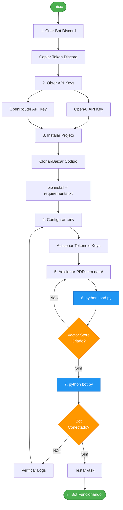
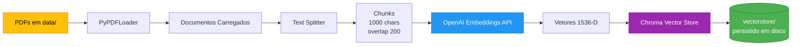

# Instalação e Configuração

## Fluxo de Instalação Completo



## Pré-requisitos

Antes de começar, você precisará de:

- ✅ Python 3.11 ou superior
- ✅ Conta Discord Developer
- ✅ API Keys (OpenAI, OpenRouter)
- ✅ Git (opcional, para clonar)

## Passo 1: Criar Bot no Discord

### 1.1 Criar Aplicação

1. Acesse [Discord Developer Portal](https://discord.com/developers/applications)
2. Clique em **New Application**
3. Dê um nome ao seu bot (ex: "RAG Bot")
4. Aceite os termos e clique em **Create**

### 1.2 Configurar Bot

1. No menu lateral, clique em **Bot**
2. Clique em **Add Bot** → **Yes, do it!**
3. **Copie o Token** (você vai precisar dele depois)
   - Clique em **Reset Token** se necessário
   - ⚠️ **IMPORTANTE**: Guarde o token em local seguro

### 1.3 Habilitar Intents

Em **Privileged Gateway Intents**, ative:

- ✅ **PRESENCE INTENT** (opcional)
- ✅ **SERVER MEMBERS INTENT** (opcional)
- ✅ **MESSAGE CONTENT INTENT** (obrigatório)

### 1.4 Gerar URL de Convite

1. Vá em **OAuth2** → **URL Generator**
2. Em **SCOPES**, selecione:
   - ✅ `bot`
   - ✅ `applications.commands`
3. Em **BOT PERMISSIONS**, selecione:
   - ✅ Send Messages
   - ✅ Read Message History
   - ✅ Use Slash Commands
   - ✅ Read Messages/View Channels
4. Copie a **GENERATED URL** e abra em nova aba
5. Selecione seu servidor e autorize

## Passo 2: Obter API Keys

### 2.1 OpenAI (Embeddings)

1. Criar conta em [OpenAI Platform](https://platform.openai.com/)
2. Vá em **API Keys** → **Create new secret key**
3. Dê um nome (ex: "Bot RAG") e copie a chave
4. **Custo**: ~$0.02 por 1M tokens (muito baixo)

!!! tip "Dica de Economia"
    Embeddings são muito baratos. Para 1000 páginas de PDFs, você gasta menos de $1.

### 2.2 OpenRouter (LLM)

1. Criar conta em [OpenRouter](https://openrouter.ai/)
2. Vá em **Settings** → **API Keys** → **Create Key**
3. Dê um nome e copie a chave
4. **Opcional**: Adicionar créditos (alguns modelos são gratuitos)

#### Modelos Recomendados

| Modelo | Custo | Qualidade | Uso |
|--------|-------|-----------|-----|
| `minimax/minimax-m2:free` | Gratuito | Boa | Testes e produção econômica |
| `anthropic/claude-3-haiku` | $0.25/M | Muito boa | Produção balanceada |
| `anthropic/claude-3.5-sonnet` | $3/M | Excelente | Produção premium |
| `google/gemini-flash-1.5` | $0.075/M | Boa | Produção econômica |

## Passo 3: Instalar Projeto

### 3.1 Clonar Repositório (ou baixar)

```bash
git clone https://github.com/seu-usuario/discord-rag-bot.git
cd discord-rag-bot
```

Ou baixe e extraia o ZIP.

### 3.2 Instalar Dependências

```bash
pip install -r requirements.txt
```

!!! warning "Atenção"
    Se você estiver usando um ambiente virtual, ative-o primeiro:
    ```bash
    python -m venv venv
    source venv/bin/activate  # Linux/Mac
    venv\Scripts\activate     # Windows
    ```

### 3.3 Verificar Instalação

```bash
python --version  # Deve ser 3.11+
pip list | grep langchain  # Deve mostrar pacotes langchain
```

## Passo 4: Configurar Variáveis de Ambiente

### 4.1 Criar Arquivo `.env`

Na raiz do projeto, crie um arquivo `.env`:

```bash
DISCORD_TOKEN=MTIzNDU2Nzg5MDEyMzQ1Njc4OQ.GaBcDe.FgHiJkLmNoPqRsTuVwXyZ
OPENAI_API_KEY=sk-proj-abcdefghijklmnopqrstuvwxyz
OPENROUTER_API_KEY=sk-or-v1-abcdefghijklmnopqrstuvwxyz
OPENROUTER_MODEL=minimax/minimax-m2:free
```

!!! danger "Segurança"
    - **NUNCA** commite o arquivo `.env` no git
    - O `.gitignore` já está configurado para ignorá-lo
    - Se expor acidentalmente, **regenere** as chaves imediatamente

### 4.2 Usar Template (Opcional)

Copie o template:

```bash
cp .env.example .env
```

Depois edite `.env` com suas chaves.

### 4.3 Variáveis Disponíveis

| Variável | Obrigatória | Descrição | Exemplo |
|----------|-------------|-----------|---------|
| `DISCORD_TOKEN` | ✅ Sim | Token do bot Discord | `MTIzNDU2...` |
| `OPENAI_API_KEY` | ✅ Sim | Chave OpenAI (embeddings) | `sk-proj-...` |
| `OPENROUTER_API_KEY` | ✅ Sim | Chave OpenRouter (LLM) | `sk-or-v1-...` |
| `OPENROUTER_MODEL` | ❌ Não | Modelo LLM | `anthropic/claude-3.5-sonnet` |

## Passo 5: Preparar Documentos

### 5.1 Criar Pasta `data/`

```bash
mkdir data
```

### 5.2 Adicionar PDFs

Copie seus arquivos PDF para a pasta `data/`:

```
data/
├── manual-de-redacao.pdf
├── guia-tecnico.pdf
└── documentacao.pdf
```

!!! tip "Formatos Suportados"
    Atualmente o bot suporta apenas **PDFs**. Suporte para DOCX, TXT e Markdown virá em versões futuras.

### 5.3 Verificar PDFs

```bash
ls -lh data/
```

Você deve ver seus PDFs listados.

## Passo 6: Indexar Documentos

### Fluxo de Indexação (Alimentar o RAG)



**Processo Detalhado:**

1. **Leitura** → PDFs extraídos da pasta `data/`
2. **Divisão** → Texto dividido em chunks de 1000 caracteres
3. **Embedding** → Cada chunk convertido em vetor (1536 dimensões)
4. **Armazenamento** → Vetores salvos no Chroma para busca rápida

### 6.1 Executar Script de Indexação

```bash
python load.py
```

### 6.2 Output Esperado

```
============================================================
🚀 INDEXAÇÃO DE DOCUMENTOS - RAG PT-BR
============================================================

[INFO] Carregando documentos...
[✅] Encontrados 3 arquivos PDF
[✅] 189 páginas carregadas
[INFO] Dividindo documentos em chunks...
[✅] 540 chunks criados
[INFO] Configurando OpenAI embeddings...
[✅] OpenAI embeddings configurado
[INFO] Criando vectorstore Chroma...
[⏳] Isso pode levar alguns minutos...
[✅] Vectorstore salvo em 'vectorstore/'

============================================================
✅ INDEXAÇÃO CONCLUÍDA COM SUCESSO!
============================================================
📊 Total de vetores: 540
📁 Localização: vectorstore/

💡 Próximo passo: Execute 'python bot.py' para iniciar o bot
============================================================
```

!!! info "Tempo de Indexação"
    - **Pequeno** (50 páginas): ~30 segundos
    - **Médio** (200 páginas): ~2 minutos
    - **Grande** (1000 páginas): ~10 minutos

### 6.3 Verificar Vector Store

```bash
ls -lah vectorstore/
```

Você deve ver arquivos do Chroma criados.

## Passo 7: Iniciar o Bot

### Fluxo de Inicialização do Bot

```mermaid
graph TB
    Start([python bot.py]) --> LoadEnv[Carregar .env]
    LoadEnv --> CheckTokens{Tokens<br/>válidos?}
    CheckTokens -->|Não| Error1[❌ Erro: Falta token]
    CheckTokens -->|Sim| LoadRAG[Carregar RAG]
    
    LoadRAG --> CheckVector{Vector Store<br/>existe?}
    CheckVector -->|Não| Error2[⚠️ RAG não carregado]
    CheckVector -->|Sim| LoadChroma[Carregar Chroma DB]
    
    LoadChroma --> ConfigLLM[Configurar LLM OpenRouter]
    ConfigLLM --> ConnectDiscord[Conectar ao Discord]
    
    ConnectDiscord --> CheckConn{Conexão<br/>OK?}
    CheckConn -->|Não| Error3[❌ Erro de conexão]
    CheckConn -->|Sim| SyncCmds[Sincronizar Comandos]
    
    SyncCmds --> Ready[✅ Bot Online]
    Ready --> Listen[Aguardar Interações]
    
    Listen --> Slash[/ask recebido]
    Listen --> Mention[@menção recebida]
    Listen --> DM[DM recebida]
    
    Slash --> Process[processar_pergunta]
    Mention --> Process
    DM --> Process
    
    Error1 --> End([Encerrar])
    Error2 --> Listen
    Error3 --> End
    
    style Start fill:#4CAF50,stroke:#2E7D32,color:#fff
    style Ready fill:#4CAF50,stroke:#2E7D32,color:#fff
    style Error1 fill:#f44336,stroke:#c62828,color:#fff
    style Error2 fill:#FF9800,stroke:#F57C00,color:#fff
    style Error3 fill:#f44336,stroke:#c62828,color:#fff
    style Process fill:#2196F3,stroke:#1976D2,color:#fff
```

**Processo de Inicialização:**

1. **Ambiente** → Carrega variáveis do `.env`
2. **RAG** → Carrega vector store Chroma
3. **LLM** → Configura OpenRouter com modelo escolhido
4. **Discord** → Conecta e sincroniza comandos slash
5. **Pronto** → Aguarda interações dos usuários

### 7.1 Executar Bot

```bash
python bot.py
```

### 7.2 Output Esperado

```
[INFO] Carregando RAG...
[✅] RAG carregado com sucesso.
[✅] Bot conectado como RagBot#1234
[✅] 3 comandos sincronizados
```

!!! success "Bot Online!"
    Se você viu essas mensagens, o bot está rodando! 🎉

### 7.3 Testar no Discord

No seu servidor Discord, digite:

```
/ask pergunta: Olá! Como você funciona?
```

O bot deve responder!

## Verificação Pós-Instalação

### Checklist

- [ ] Bot aparece online no Discord
- [ ] Comando `/ask` está disponível
- [ ] Bot responde perguntas
- [ ] Logs estão sendo criados em `logs/bot.log`
- [ ] Sem erros no console

### Comandos de Teste

```
/ask pergunta: Teste de funcionamento
/status
/config nivel: moderado
```

## Problemas Comuns

### Bot não conecta

**Erro**: `discord.errors.LoginFailure: Improper token has been passed.`

**Solução**: Verifique se `DISCORD_TOKEN` está correto no `.env`

### RAG não carrega

**Erro**: `Vectorstore não encontrado em 'vectorstore/'`

**Solução**: Execute `python load.py` primeiro

### Erro de API Key

**Erro**: `OPENAI_API_KEY não encontrada no .env`

**Solução**: Adicione a chave no arquivo `.env`

Para mais problemas, consulte [Troubleshooting](troubleshooting.md).

## Próximos Passos

✅ Instalação completa!

👉 Continue para [Uso](usage.md) para aprender todos os comandos  
👉 Ou veja [Logs](logs.md) para monitorar o bot
